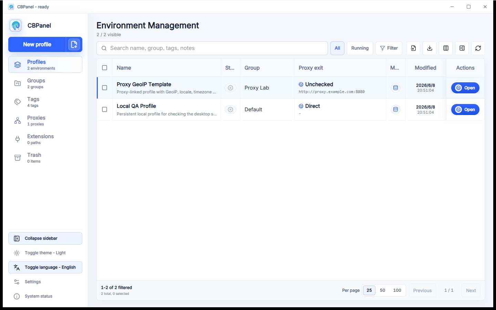

# CBPanel

[中文说明](README.zh-CN.md)

CBPanel is a local Web + Desktop management shell for [CloakBrowser](https://github.com/CloakHQ/CloakBrowser/).



## Quick Start

```bash
npm install
npm run dev
```

The development server runs at:

```text
http://127.0.0.1:4173
```

Useful checks:

```bash
npm run typecheck
npm test
npm run build
```

Desktop commands:

```bash
npm run desktop:dev
npm run release:windows
npm run release:linux
```

## Downloads

| Platform | Artifact |
| --- | --- |
| Windows | Installer `.exe` or portable `.zip` |
| Linux | x64 `.AppImage` |

Linux:

```bash
chmod +x CBPanel-linux-x64.AppImage
./CBPanel-linux-x64.AppImage
```

## License

- **CBPanel** — MIT. See [LICENSE](LICENSE).
- **CloakBrowser wrapper code** — MIT. See [CloakBrowser LICENSE](https://github.com/CloakHQ/CloakBrowser/blob/main/LICENSE).
- **CloakBrowser binary** (compiled Chromium) — free to use, no redistribution. See [BINARY-LICENSE.md](https://github.com/CloakHQ/CloakBrowser/blob/main/BINARY-LICENSE.md).
