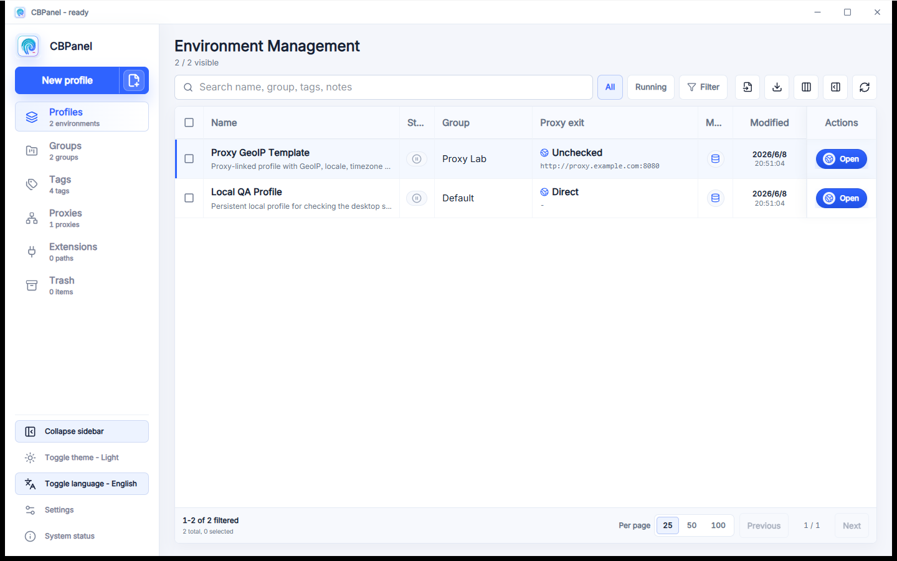

# CBPanel

[English](README.md)

CBPanel 是 [CloakBrowser](https://github.com/CloakHQ/CloakBrowser/) 的本地 Web + Desktop 管理壳程序。



## 兼容性说明

开发和 CI 工具链要求 Node.js 26 或更高版本（npm 11 或更高版本），Tauri 桌面壳要求 Rust 1.88.0 或更高版本。目前只测试过 Windows 便携版；其他产物按当前状态提供，不保证可用。

## 快速开始

```bash
npm install
npm run dev
```

如需严格按锁文件安装依赖，请使用 `npm ci`。

开发服务默认运行在：

```text
http://127.0.0.1:4173
```

常用检查：

```bash
npm run typecheck
npm test
npm run build
```

桌面端命令：

```bash
npm run desktop:dev
npm run release:windows
npm run release:linux
```

## 下载

| 平台 | 产物 |
| --- | --- |
| Windows | 安装版 `.exe` 或便携版 `.zip` |
| Linux | x64 `.AppImage` |

Linux：

```bash
chmod +x CBPanel-linux-x64.AppImage
./CBPanel-linux-x64.AppImage
```

## 许可证

- **CBPanel** — MIT。见 [LICENSE](LICENSE)。
- **CloakBrowser wrapper 代码** — MIT。见 [CloakBrowser LICENSE](https://github.com/CloakHQ/CloakBrowser/blob/main/LICENSE)。
- **CloakBrowser binary**（编译后的 Chromium）— 可免费使用，不可再分发。见 [BINARY-LICENSE.md](https://github.com/CloakHQ/CloakBrowser/blob/main/BINARY-LICENSE.md)。
